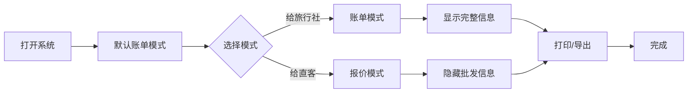

# 🎉 双模式功能更新完成

## ✅ 更新内容

### 核心功能：双模式切换系统

成功实现了**账单模式** (Bill Mode) 和**报价模式** (Quote Mode) 的无缝切换功能。

---

## 📁 修改的文件

### 1. **HTML 文件** (`index.html`)
- ✅ 添加了模式切换按钮组（账单/报价）
- ✅ 为表格表头列添加 `bill-only` 类标识
- ✅ 为表格数据列添加 `bill-only` 类标识  
- ✅ 为总计区域的批发信息添加 `bill-only` 类
- ✅ 为表单输入框的佣金字段添加 `bill-only` 类
- ✅ 给标题添加 `id="app-title"` 以便动态更新

### 2. **CSS 文件** (`css/style.css`)
- ✅ 添加 `.mode-switcher` 样式 - 模式切换按钮容器
- ✅ 添加 `.btn-mode` 样式 - 模式按钮基础样式
- ✅ 添加 `.btn-mode.active` 样式 - 激活状态样式
- ✅ 添加 `.quote-mode .bill-only` 样式 - 报价模式下隐藏批发信息

### 3. **JavaScript 文件** (`js/main.js`)
- ✅ 添加 `currentMode` 变量 - 存储当前模式
- ✅ 添加 `switchMode(mode)` 函数 - 切换模式
- ✅ 添加 `getCurrentMode()` 函数 - 获取当前模式
- ✅ 添加 `initMode()` 函数 - 初始化模式（从 localStorage 读取）
- ✅ 更新表格渲染代码 - 为批发相关列添加 `bill-only` 类
- ✅ 在页面加载时调用 `initMode()`

### 4. **多语言文件** (`js/i18n.js`)
- ✅ 添加中文翻译：`appTitleQuote`, `btnModeBill`, `btnModeQuote`, `modeSwitchTip`
- ✅ 添加西班牙语翻译：对应的西班牙语版本
- ✅ 添加英语翻译：对应的英语版本

### 5. **新增文档**
- ✅ `MODE_FEATURE.md` - 详细的功能说明文档
- ✅ `DUAL_MODE_UPDATE.md` - 本更新总结文档

---

## 🎯 功能特性

### 账单模式 (Bill Mode)
**适用场景：** B2B 批发业务

**显示内容：**
- ✅ 完整的 8 列表格
- ✅ 舱房说明、人数、直客价
- ✅ **净船票**（批发价）
- ✅ **佣金详情**（含计算公式）
- ✅ 税费、服务费
- ✅ **结算价**（实际支付价）

**总计区域：**
- ✅ 直客总价
- ✅ 税费服务费总额
- ✅ **净船票总价**
- ✅ **减：佣金**
- ✅ **实付结算价**

**表单编辑：**
- ✅ **佣金比例输入框**
- ✅ **附加佣金比例输入框**

---

### 报价模式 (Quote Mode)
**适用场景：** B2C 直客报价

**显示内容：**
- ✅ 简化的 5 列表格
- ✅ 舱房说明、人数、直客价
- ❌ ~~净船票~~（隐藏）
- ❌ ~~佣金~~（隐藏）
- ✅ 税费、服务费
- ❌ ~~结算价~~（隐藏）

**总计区域：**
- ✅ 直客总价
- ✅ 税费服务费总额
- ❌ ~~净船票总价~~（隐藏）
- ❌ ~~减：佣金~~（隐藏）
- ❌ ~~实付结算价~~（隐藏）

**表单编辑：**
- ❌ ~~佣金比例输入框~~（隐藏）
- ❌ ~~附加佣金比例输入框~~（隐藏）

---

## 💡 技术亮点

### 1. **CSS 类控制显示**
```css
/* 报价模式下隐藏批发信息 */
.quote-mode .bill-only {
  display: none !important;
}
```

### 2. **动态标题更新**
```javascript
// 账单模式
appTitle.textContent = t('appTitle')  // "分销账单"

// 报价模式  
appTitle.textContent = t('appTitleQuote')  // "客户报价"
```

### 3. **本地存储持久化**
```javascript
// 保存模式选择
localStorage.setItem('viewMode', mode)

// 读取模式选择
const savedMode = localStorage.getItem('viewMode') || 'bill'
```

### 4. **多语言无缝切换**
- 模式名称支持三语
- 标题动态更新支持三语
- 按钮文本支持三语

---

## 🎨 用户界面

### 模式切换按钮

**位置：** 顶部工具栏左侧

**账单模式按钮：**
- 图标：文档图标（账单）
- 颜色：蓝色（激活时）
- 文本：账单模式 / Modo Factura / Bill Mode

**报价模式按钮：**
- 图标：文档图标（报价）
- 颜色：蓝色（激活时）
- 文本：报价模式 / Modo Cotización / Quote Mode

**视觉效果：**
- 未激活：灰色背景，灰色文字
- 激活：蓝色背景，白色文字
- Hover：浅蓝色背景

---

## 🔄 使用流程

### 典型工作流程



### 操作步骤

1. **打开系统** - 自动加载上次的模式选择
2. **选择模式** - 点击顶部的模式切换按钮
3. **编辑内容** - 输入舱房、价格等信息
4. **预览效果** - 右侧实时预览当前模式的显示效果
5. **打印/导出** - 按当前模式打印或导出 PDF

---

## 📊 对比表

| 功能 | 账单模式 | 报价模式 |
|------|----------|----------|
| **适用对象** | 旅行社、分销商 | 散客、直客 |
| **业务类型** | B2B | B2C |
| **显示净船票** | ✅ 是 | ❌ 否 |
| **显示佣金** | ✅ 是 | ❌ 否 |
| **显示结算价** | ✅ 是 | ❌ 否 |
| **佣金输入框** | ✅ 显示 | ❌ 隐藏 |
| **表格列数** | 8 列 | 5 列 |
| **总计项数** | 5 项 | 2 项 |

---

## 🚀 使用示例

### 示例 1：旅行社账单

**场景：** 给合作旅行社开具结算账单

**操作：**
1. 选择 **账单模式**
2. 录入客户信息（包括佣金比例 15%）
3. 录入舱房信息：
   - Balcony / Fantastica / Basic
   - 人数：2
   - 直客价：€2,000
   - 税费：€200
   - 服务费：€200
4. 系统自动计算：
   - 净船票：€1,600
   - 佣金：-€300 (15%)
   - 结算价：€1,700

**显示效果：**
```
┌─────────────────────────────────────────────────────┐
│ 账单 BILL                                            │
├─────────────────────────────────────────────────────┤
│ 舱房说明 │ PAX │ 直客价 │ 净船票 │ 佣金  │ 税费 │ HSC │ 结算价 │
│ Balcony  │  2  │ 2,000 │ 1,600 │ -300 │ 200 │ 200 │ 1,700 │
├─────────────────────────────────────────────────────┤
│ 直客总价：EUR 2,000                                  │
│ 净船票总价：1,600                                    │
│ 减：佣金：-300                                       │
│ 实付结算价：EUR 1,700                                │
└─────────────────────────────────────────────────────┘
```

---

### 示例 2：散客报价单

**场景：** 给终端客户提供报价

**操作：**
1. 选择 **报价模式**
2. 录入舱房信息：
   - Balcony / Fantastica / Basic
   - 人数：2
   - 直客价：€2,000
   - 税费：€200
   - 服务费：€200

**显示效果：**
```
┌───────────────────────────────────────┐
│ 客户报价 QUOTATION                     │
├───────────────────────────────────────┤
│ 舱房说明 │ PAX │ 直客价 │ 税费 │ HSC │
│ Balcony  │  2  │ 2,000 │ 200 │ 200 │
├───────────────────────────────────────┤
│ 直客总价：EUR 2,000                    │
│ 税费服务费：400                        │
└───────────────────────────────────────┘
```

✅ 客户看到的是干净、简洁的报价，没有批发信息

---

## ⚙️ 技术架构

### 数据流

```
用户点击模式按钮
    ↓
switchMode(mode)
    ↓
更新按钮状态
    ↓
添加/删除 quote-mode 类
    ↓
更新标题文本
    ↓
保存到 localStorage
    ↓
重新渲染表格
```

### 渲染逻辑

```javascript
// 表格行渲染时添加 bill-only 类
tr.innerHTML = `
  <td>${description}</td>
  <td>${qty}</td>
  <td>${grossPrice}</td>
  <td class="bill-only">${baseFare}</td>      // 仅账单模式
  <td class="bill-only">${commission}</td>    // 仅账单模式
  <td>${tax}</td>
  <td>${hsc}</td>
  <td class="bill-only">${netPayable}</td>    // 仅账单模式
`
```

### CSS 控制

```css
/* 默认都显示 */
.bill-only {
  display: table-cell;
}

/* 报价模式下隐藏 */
.quote-mode .bill-only {
  display: none !important;
}
```

---

## 🔐 安全性

- ✅ **模式切换不修改数据** - 只改变显示方式
- ✅ **数据完整性保持** - 所有数据保存在内存和 Firebase
- ✅ **模式选择本地保存** - 不会同步到云端
- ✅ **切换无需刷新** - 即时生效

---

## 📱 响应式支持

- ✅ 桌面端完美显示
- ✅ 平板端自适应
- ✅ 移动端友好（模式按钮可能需要滚动查看）

---

## 🎯 未来优化建议

### 可能的增强功能

1. **快捷键支持**
   ```
   Alt + 1  → 账单模式
   Alt + 2  → 报价模式
   ```

2. **模式预设**
   - 为不同客户类型设置默认模式
   - 选择客户时自动切换到对应模式

3. **打印模板**
   - 为两种模式设计不同的打印样式
   - 报价模式可以有更精美的排版

4. **导出选项**
   - 导出时可选择模式
   - 支持同时导出两种版本

5. **统计功能**
   - 统计两种模式的使用频率
   - 分析不同客户类型的使用情况

---

## 📝 注意事项

### ⚠️ 重要提示

1. **模式不影响数据完整性**
   - 无论哪种模式，数据都完整保存
   - 切换模式不会丢失任何信息

2. **打印前检查模式**
   - 确保选择了正确的模式再打印
   - 给旅行社用账单模式
   - 给直客用报价模式

3. **模式自动保存**
   - 关闭浏览器后重新打开会保持上次的模式
   - 如需默认模式可手动切换

4. **多语言同步**
   - 切换语言时模式保持不变
   - 模式名称会自动翻译

---

## 🎉 总结

成功实现了**双模式切换功能**，让系统能够灵活应对不同的业务场景：

- ✅ **B2B 批发** - 使用账单模式，显示完整的佣金和结算信息
- ✅ **B2C 直销** - 使用报价模式，只显示最终价格，隐藏批发细节

这个功能大大提升了系统的实用性和专业性！

---

**版本：** 7.3.6  
**更新日期：** 2025-12-06  
**开发团队：** FH Global

**🚀 享受全新的双模式功能！**
