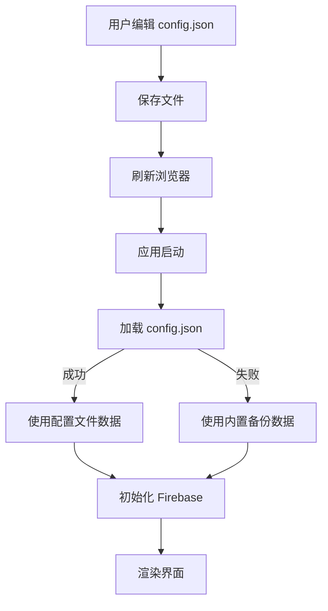

# ✅ JSON 配置文件功能已完成

## 🎯 功能总结

系统已成功实现**数据与代码分离**，所有业务数据现在都可以在独立的 JSON 文件中直接修改，无需修改代码！

---

## 📁 配置文件位置

```
/data/config.json
```

---

## 🔧 已实现的功能

### 1. **配置文件加载机制**
- ✅ 应用启动时自动加载 `data/config.json`
- ✅ 加载成功会在控制台显示 `✅ 配置文件加载成功`
- ✅ 如果加载失败，自动使用内置备份数据
- ✅ 控制台会显示 `❌ 配置文件加载失败，使用默认配置`

### 2. **可配置的数据项**

#### 📋 **clients** - 客户列表
包含所有常用客户信息：
- 商用名称 (tradeName)
- 公司注册名称 (company)
- 税号 (taxId)
- 地址 (address)
- 基础佣金比例 (rate)
- 附加产品佣金比例 (addonRate)

#### 🚢 **ships** - 船只列表
- 包含 MSC、Costa 等邮轮公司的所有船只
- 支持分组标题（用 `━━━` 包围）
- 中英文双语格式

#### 🗺️ **routes** - 航线列表
- 地中海、北欧、加勒比等常用航线
- 中英文双语格式

#### 🛏️ **cabinTypes** - 舱房类型
- 内舱、海景、阳台等舱房类型

#### ⭐ **experienceTypes** - 体验等级
- Bella、Fantastica 等 MSC 体验等级

#### 💰 **priceTypes** - 价格类型
- Basic、Special 等价格分类

#### ➕ **addonProducts** - 附加产品
- Wifi、岸上观光、酒水包等附加服务

#### ⚙️ **defaults** - 默认设置
- **payment**: 默认支付信息
- **remarks**: 默认备注条款
- **adminPassword**: 管理员密码（用于删除客户等敏感操作）

---

## 📝 使用方法

### 方法 1：直接编辑 JSON 文件

1. **打开文件**
   ```bash
   # 使用你喜欢的编辑器打开
   code data/config.json          # VS Code
   # 或
   open -a TextEdit data/config.json  # macOS 文本编辑器
   ```

2. **修改数据**
   - 添加新客户、船只、航线等
   - 修改默认支付信息、备注
   - 更改管理员密码

3. **保存文件**
   - 确保保存为 UTF-8 编码
   - 不要添加 BOM

4. **刷新浏览器**
   - 按 `Cmd + R` (Mac) 或 `Ctrl + R` (Windows)
   - 配置会自动重新加载

### 方法 2：在线验证 JSON 格式

修改前后建议使用在线工具验证：
- https://jsonlint.com/
- https://www.jsonformatter.io/

---

## 💡 常见修改示例

### 示例 1：添加新客户

```json
{
  "clients": [
    // ... 现有客户 ...
    {
      "tradeName": "阳光旅行社",
      "company": "SUNSHINE TRAVEL, S.L.",
      "taxId": "B99999999",
      "address": "Calle Sol, 10, 28013 Madrid",
      "rate": 12,
      "addonRate": 3
    }
  ]
}
```

### 示例 2：添加新船只

```json
{
  "ships": [
    "━━━ MSC CRUISES ━━━",
    "MSC 欧罗巴号 MSC World Europa",
    "MSC 新世界号 MSC New World",  // ← 新添加的
    // ... 其他船只 ...
  ]
}
```

### 示例 3：修改管理员密码

```json
{
  "defaults": {
    "payment": "...",
    "remarks": "...",
    "adminPassword": "my_secure_password_2025"  // ← 修改这里
  }
}
```

### 示例 4：修改默认支付信息

```json
{
  "defaults": {
    "payment": "银行: BBVA\n户名: MI EMPRESA, S.L.\n账号: ES1234567890\nSWIFT: BBVAESMMXXX",
    "remarks": "...",
    "adminPassword": "..."
  }
}
```

**注意：** 在 JSON 中使用 `\n` 表示换行

---

## ⚠️ 重要提示

### JSON 格式规则

1. **字符串必须用双引号** `"`
   ```json
   ✅ "tradeName": "环球之旅"
   ❌ 'tradeName': '环球之旅'
   ```

2. **数组最后一项不能有逗号**
   ```json
   ✅ ["item1", "item2", "item3"]
   ❌ ["item1", "item2", "item3",]
   ```

3. **对象最后一个字段不能有逗号**
   ```json
   ✅ { "name": "test", "value": 123 }
   ❌ { "name": "test", "value": 123, }
   ```

4. **换行符**
   ```json
   ✅ "第一行\n第二行"
   ❌ "第一行
        第二行"  // JSON 中不能直接换行
   ```

5. **特殊字符需要转义**
   ```json
   ✅ "He said \"Hello\""
   ❌ "He said "Hello""
   ```

---

## 🛠️ 故障排除

### 问题 1：配置文件不生效

**解决方法：**
1. 打开浏览器控制台 (F12)
2. 查看是否有 `✅ 配置文件加载成功` 消息
3. 如果看到 `❌ 配置文件加载失败`，检查 JSON 格式

### 问题 2：JSON 格式错误

**解决方法：**
1. 复制 `data/config.json` 的全部内容
2. 访问 https://jsonlint.com/
3. 粘贴内容并点击 "Validate JSON"
4. 根据错误提示修复格式问题

### 问题 3：修改后页面显示异常

**解决方法：**
1. 恢复备份文件（如果有）
2. 检查是否误删了某些必需字段
3. 清除浏览器缓存 (Cmd+Shift+R 或 Ctrl+Shift+R)
4. 查看控制台错误信息

---

## 📊 数据流程图



---

## 🔐 安全建议

1. **定期备份配置文件**
   ```bash
   cp data/config.json data/config.backup.$(date +%Y%m%d).json
   ```

2. **妥善保管管理员密码**
   - 不要使用简单密码
   - 定期更换密码
   - 不要在配置文件注释中暴露密码

3. **版本控制**
   - 如果使用 Git，建议将敏感信息（如银行账号）添加到 `.gitignore`
   - 或使用环境变量存储敏感数据

---

## 📚 技术细节

### 加载流程

1. `main.js` 第 8-19 行定义了 `loadConfig()` 函数
2. 第 743 行在应用启动时调用 `loadConfig()`
3. 配置加载成功后再启动 Firebase 认证
4. `CONFIG_DATA` 变量存储加载的配置数据

### 获取配置数据的辅助函数

- `getDefaultPayment()` - 获取默认支付信息
- `getDefaultRemarks()` - 获取默认备注
- `getAdminPassword()` - 获取管理员密码
- `getBackupData()` - 获取备份数据用于 Firebase 初始化

### 备用机制

如果 `config.json` 加载失败，系统会自动使用内置在 `getFallbackData()` 函数中的备份数据，确保应用始终可用。

---

## 🎉 优势

1. **数据与代码分离** - 无需修改代码即可更新数据
2. **易于维护** - 集中管理所有配置数据
3. **灵活性高** - 可以快速添加/修改客户、船只等信息
4. **容错机制** - 即使配置文件损坏也能使用备份数据
5. **可读性强** - JSON 格式清晰易懂

---

## 📞 技术支持

如有问题请检查：
1. 浏览器控制台的错误信息 (F12)
2. JSON 格式是否正确
3. 文件编码是否为 UTF-8
4. 文件路径是否正确

---

**版本：** 2.0  
**最后更新：** 2025-12-06  
**维护者：** FH Global 开发团队

---

## ✨ 下一步

现在你可以：
1. ✅ 直接编辑 `data/config.json` 添加新客户
2. ✅ 修改默认支付信息和备注
3. ✅ 更新管理员密码
4. ✅ 添加新的船只和航线
5. ✅ 所有修改立即生效，只需刷新浏览器！

**享受便捷的配置管理！** 🚀
