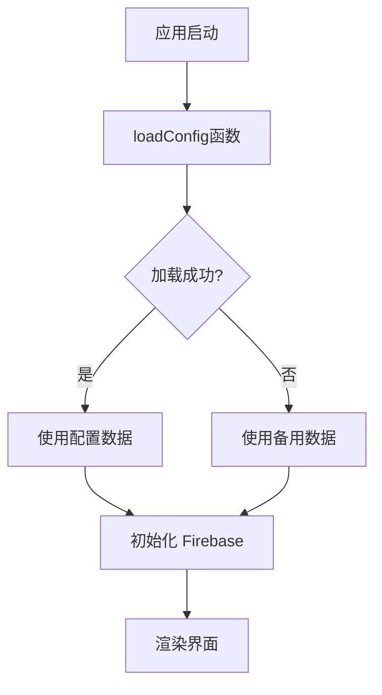

# 🎉 更新完成总结

## ✅ 本次更新内容

### 🎯 核心功能：数据配置独立化

将所有业务数据从代码中分离出来，创建了独立的 JSON 配置文件，实现了**数据与代码分离**的架构。

---

## 📁 新增文件

### 1. **核心配置文件**
- ✅ `/data/config.json` - 主配置文件（所有数据集中管理）

### 2. **说明文档**
- ✅ `/data/README.md` - 详细的配置文件说明文档
- ✅ `/JSON_CONFIG_GUIDE.md` - 完整的使用指南
- ✅ `/QUICK_REFERENCE.md` - 快速参考卡片

---

## 🔧 修改的文件

### `/js/main.js`
- ✅ 添加了 `loadConfig()` 函数 - 从 JSON 文件加载配置
- ✅ 添加了 `getFallbackData()` 函数 - 配置加载失败时的备用数据
- ✅ 添加了 `getBackupData()` 函数 - 为 Firebase 提供初始数据
- ✅ 添加了 `getDefaultPayment()` 函数 - 获取默认支付信息
- ✅ 添加了 `getDefaultRemarks()` 函数 - 获取默认备注
- ✅ 添加了 `getAdminPassword()` 函数 - 获取管理员密码
- ✅ 修复了配置文件路径：`./data/config.json`

---

## 📊 配置文件包含的数据

### 1. **clients** - 客户列表
已包含 6 个常用客户：
- 环球之旅 (DYNASTY TICKETING Kft.)
- 蓝天旅行社 (VIAJES ANDY, S.L.)
- 长城旅行社 (VIAJES GRAN MURALLA, S.L.)
- 中天旅行社 (VIAJES DESPEJADO, S.L.)
- 环球旅行社 (GRAN ASIA TOUR, S.L.)
- 凯越旅行社 (FREEMAN TRAVEL CO, S.L.)

### 2. **ships** - 船只列表
包含 MSC 和 Costa 邮轮公司的所有船只（30+ 艘）

### 3. **routes** - 航线列表
包含 6 条主要航线：
- 地中海航线
- 北欧航线
- 加勒比海与北美航线
- 中东航线
- 南美航线
- 长航线与环球

### 4. **cabinTypes** - 舱房类型
- Interior (内舱)
- Oceanview (海景)
- Balcony (阳台)

### 5. **experienceTypes** - 体验等级
- Bella (美妙级)
- Fantastica (梦幻)

### 6. **priceTypes** - 价格类型
- Basic (基础)
- Special (特价)

### 7. **addonProducts** - 附加产品
- Wifi Package (网络包)
- Shore Excursion (岸上观光)
- Drink Package (酒水)
- Service Charge (服务费)
- Transfer (接送)

### 8. **defaults** - 默认设置
- 默认支付信息（银行账号等）
- 默认备注条款
- 管理员密码：`fh2025`

---

## 🚀 使用方法

### 快速修改数据的 4 个步骤：

1. **打开配置文件**
   ```bash
   # 使用文本编辑器打开
   code data/config.json
   # 或
   open -a TextEdit data/config.json
   ```

2. **修改数据**
   - 添加新客户、船只、航线等
   - 修改默认支付信息
   - 更改管理员密码

3. **保存文件**
   - 确保使用 UTF-8 编码
   - 验证 JSON 格式是否正确

4. **刷新浏览器**
   - macOS: `Cmd + R`
   - Windows: `Ctrl + R`

### 验证配置加载状态：

1. 打开浏览器控制台 (F12)
2. 查看加载信息：
   - ✅ `✅ 配置文件加载成功` - 配置正常
   - ❌ `❌ 配置文件加载失败，使用默认配置` - 检查 JSON 格式

---

## 💡 实际应用示例

### 场景 1：添加新客户

在 `data/config.json` 中添加：

```json
{
  "clients": [
    {
      "tradeName": "新旅行社",
      "company": "NEW TRAVEL AGENCY, S.L.",
      "taxId": "B12345678",
      "address": "Calle Example, 123, 28001 Madrid",
      "rate": 10,
      "addonRate": 5
    }
  ]
}
```

保存后刷新浏览器，新客户立即出现在下拉列表中！

### 场景 2：修改管理员密码

```json
{
  "defaults": {
    "adminPassword": "new_secure_password_2025"
  }
}
```

保存后，删除客户时需要输入新密码。

### 场景 3：更新银行账号

```json
{
  "defaults": {
    "payment": "Bank: NEW_BANK\nName: COMPANY_NAME\nAccount: ES1234567890"
  }
}
```

保存后，所有新账单自动使用新的支付信息。

---

## 🔄 数据同步机制

```
配置文件 (config.json)
    ↓ 加载
应用启动
    ↓ 初始化
Firebase 数据库
    ↓ 同步
用户界面
```

- **首次加载**：配置文件 → Firebase（如果数据库为空）
- **后续使用**：Firebase → 用户界面
- **配置更新**：修改配置 → 刷新浏览器 → 重新加载

---

## ⚠️ 重要注意事项

### JSON 格式规则

1. ✅ **使用双引号**
   ```json
   "name": "value"  ← 正确
   'name': 'value'  ← 错误
   ```

2. ✅ **数组最后一项不要逗号**
   ```json
   ["item1", "item2", "item3"]  ← 正确
   ["item1", "item2", "item3",] ← 错误
   ```

3. ✅ **换行符使用 \n**
   ```json
   "第一行\n第二行"  ← 正确
   ```

4. ✅ **特殊字符需要转义**
   ```json
   "He said \"Hello\""  ← 正确
   ```

### 文件编码

- ✅ 必须使用 **UTF-8 编码**
- ✅ 不要添加 BOM 标记

### 备份建议

修改前务必备份：
```bash
cp data/config.json data/config.backup.$(date +%Y%m%d).json
```

---

## 🛠️ 故障排除

### 问题 1：配置文件不生效
**症状：** 修改后刷新浏览器，数据没有变化

**解决方法：**
1. 检查 JSON 格式是否正确
2. 使用 https://jsonlint.com/ 验证格式
3. 查看浏览器控制台的错误信息
4. 清除浏览器缓存 (Cmd+Shift+R)

### 问题 2：页面显示错误
**症状：** 页面加载失败或显示异常

**解决方法：**
1. 恢复备份文件
2. 检查是否误删了必需字段
3. 查看浏览器控制台的详细错误
4. 验证 JSON 格式

### 问题 3：新数据没有出现
**症状：** 添加的客户/船只等没有显示

**解决方法：**
1. 确认配置文件已保存
2. 完全刷新浏览器 (Cmd+Shift+R)
3. 检查 Firebase 数据库是否已同步
4. 查看控制台是否有加载成功消息

---

## 📚 技术架构

### 加载流程



### 数据流

```
config.json → CONFIG_DATA (内存) → Firebase → 用户界面
```

### 关键函数

- `loadConfig()` - 加载配置文件
- `getFallbackData()` - 提供备用数据
- `getBackupData()` - 为 Firebase 提供初始化数据
- `getDefaultPayment()` - 获取默认支付信息
- `getDefaultRemarks()` - 获取默认备注
- `getAdminPassword()` - 获取管理员密码

---

## 🎁 额外好处

1. ✅ **易于维护** - 数据集中在一个文件中
2. ✅ **无需编程知识** - 只需编辑 JSON 文件
3. ✅ **即时生效** - 刷新浏览器即可看到变化
4. ✅ **容错机制** - 配置损坏时自动使用备用数据
5. ✅ **版本控制友好** - 可以轻松追踪配置变更历史
6. ✅ **多环境支持** - 可以为不同环境创建不同配置文件

---

## 📖 参考文档

1. **详细说明** → `data/README.md`
2. **使用指南** → `JSON_CONFIG_GUIDE.md`
3. **快速参考** → `QUICK_REFERENCE.md`

---

## 🔐 安全建议

1. **定期备份配置文件**
2. **妥善保管管理员密码**
3. **不要在配置中存储高度敏感信息**
4. **如使用 Git，考虑将敏感信息添加到 .gitignore**

---

## ✨ 下一步行动

现在你可以：

1. ✅ 直接编辑 `data/config.json` 管理所有数据
2. ✅ 添加新客户、船只、航线等
3. ✅ 修改默认设置和管理员密码
4. ✅ 无需修改任何代码！

**享受更便捷的数据管理体验！** 🎊

---

**更新完成时间：** 2025-12-06  
**版本：** 7.3.6  
**开发团队：** FH Global  

**🚀 祝你使用愉快！**
